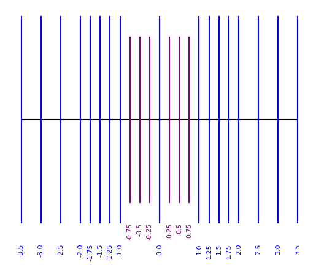

```@meta
DocTestSetup = quote
    using MicroFloatingPoints, MFPPlot, MFPRandom
end
CurrentModule = MicroFloatingPoints
```

# A guided tour


The `MicroFloatingPoints` package is organized into three modules:

- `MicroFloatingPoints`: the main module containing the definition of the parameterized type `Floatmu` and the associated method;
- `MFPRand`: the module overloading [`Random.rand`](https://docs.julialang.org/en/v1/stdlib/Random/#Base.rand) to produce `Floatmu` random values;
- `MFPPlot`: a module offering various graphical ways to display `Floatmu` floating-point numbers. 

After having correctly installed the package, we start our tour by loading the `MicroFloatingPoints` module:

```jldoctest
julia> using MicroFloatingPoints
```

We can now define a new floating-point type `MuFP` with 2 bits for the exponent and 2 bits for the fractional part:

```jldoctest exa1
julia> MuFP = Floatmu{2,2}
Floatmu{2,2}
```

Such a type is very limited, and a call to [`floatmax`](@ref) will give us the largest finite float representable:
```jldoctest exa1
julia> floatmax(MuFP)
3.5
```

Conversely, we can obtain the smallest positive float in the `MuFP` format with the [`μ`](@ref) method:
```jldoctest exa1
julia> μ(MuFP)
0.25
```
Note that this value is a [subnormal number](https://en.wikipedia.org/wiki/Denormal_number), which is different and smaller than the smallest normal float obtained by calling [`floatmin`](@ref):
```jldoctest exa1
julia> floatmin(MuFP)
1.0
```

To better assess what we can do with such a small type, let us display all finite representable values on the real line. The `MFPPlot` module has just the right method:
```jldoctest exa1
julia> using MFPPlot

julia> real_line(-floatmax(MuFP),floatmax(MuFP));
```

```@raw html
<div style="text-align: center">

</div>
```

