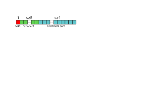

# MicroFloatingPoints

The `MicroFloatingPoints` package allows to manipulate small [IEEE 754](https://en.wikipedia.org/wiki/IEEE_754)-compliant floating-point numbers, aka. [*minifloats*](https://en.wikipedia.org/wiki/Minifloat), whose formats are smaller or equal to the `Float32` format mandated by the standard.

The library may serve to exemplify the behavior of IEEE 754 floating-point numbers in a systematic way through the use of very small formats.

## Presentation

At its core, the package defines a new type `Floatmu` parameterized by two integers:

- `szE`, the number of bits used to represent the exponent;
- `szf`, the number of bits used to represent the fractional part (excluding the so-called [*hidden bit*](https://en.wikipedia.org/wiki/Significand#The_hidden_bit_in_floating_point)).

As the figure below shows, the total length of an object of the type `Floatmu{szE,szf}` is ``1+\text{szE}+\text{szf}`` bits[^1].

[^1]: The size of the object representing a `Floatmu` may be much larger however, as it corresponds currently to two 32 bit unsigned integers per `Floatmu`.

```@raw html
<div style="text-align: center">

</div>
```

`Floatmu{szE,szf}` objects are stored in 32 bit unsigned integers, which puts a limit on the maximum value of `szE` and `szf`. All computations are performed internally with double precision `Float64` floats. To ensure that no *double rounding* will occur, viz. that the computation performed in double precision, once rounded to a `Floatmu{szE,szf}`, will give a result identical to the one we would have obtained had we performed it entirely with the precision of the `Floatmu{szE,szf}` type, we limit the size of a `Floatmu{szE,szf}` to that of a `Float32` [^Rump2016].

[^Rump2016]: IEEE754 Precision-``k`` base-``\beta`` Arithmetic Inherited by Precision-``m`` Base-``\beta`` Arithmetic for ``k<m``. Siegfried M. Rump, ACM Transactions on Mathematical Software, Vol. 43, N° 3. December 2016.

Therefore, the limits on the integers `szE` and `szf` are:

```math
\left\{\begin{array}{l}
2\leqslant\text{szE}\leqslant8\\
2\leqslant\text{szf}\leqslant23
\end{array}\right.
```

Under these constraints, one can manipulate and compute with very small floats (e.g. 2 bits for the exponent and 2 bits for the fractional part) that comply with the IEEE 754 standard.
It is also possible to emulate more established formats such as:

- `Float16`, the IEEE 754 half-precision format: `Floatmu{5,10}`
- `Float32`, the IEEE 754 single precision format: `Floatmu{8,23}`
- [`bfloat16`](https://en.wikipedia.org/wiki/Bfloat16_floating-point_format), the Brain Floating Point by Google: `Floatmu{8,7}`
- [`TensorFloat-32`](https://blogs.nvidia.com/blog/2020/05/14/tensorfloat-32-precision-format/), the format by NVIDIA: `Floatmu{8,10}`
- AMD's `fp24`: `Floatmu{7,16}`
- Pixar's PXR24: `Floatmu{8,15}`
- and many more…

## Installation

The package can be installed with the Julia package manager. From the Julia REPL, type `]` to enter the Pkg REPL mode and run:

```julia
pkg> add MicroFloatingPoints
```

Or, equivalently, via the Pkg API:

```julia
julia> import Pkg; Pkg.add("MicroFloatingPoints")
```

Note that the `matplotlib` Python package must be available through `PyCall`.


